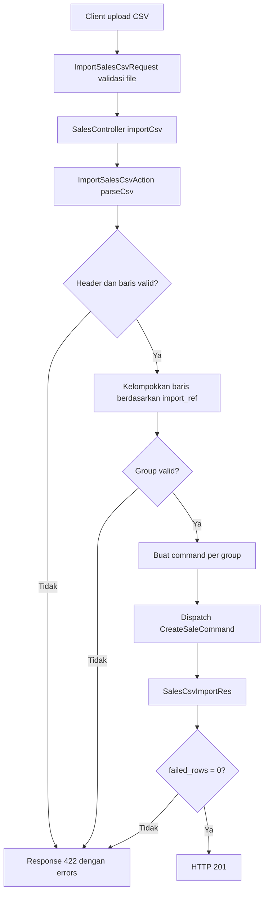

# Alur Kode Import Sales CSV

Dokumentasi ini menjelaskan implementasi endpoint import CSV sales yang berjalan saat ini, dari HTTP request hingga perintah pembuatan sale dikirim ke application layer.

## Ringkasan endpoint

- Route: `POST /api/sales/import-csv`, didaftarkan di [Routes/api.php](../Routes/api.php#L45-L58).
- Request harus menggunakan `multipart/form-data` dengan field `file`.
- Validasi request berada di [ImportSalesCsvRequest.php](../Apps/Api/Sales/ImportCsv/ImportSalesCsvRequest.php#L10-L28): file wajib ada, bertipe file, berekstensi/MIME `csv` atau `txt`, dan berukuran maksimum 2 MB.
- Controller memanggil action melalui [`SalesController::importCsv()`](../Apps/Api/Sales/SalesController.php#L38-L47). Respons menjadi HTTP `201` hanya bila [`failed_rows`](../Apps/Api/Sales/ImportCsv/SalesCsvImportRes.php#L18) bernilai `0`; selain itu respons menjadi HTTP `422`.

## Format CSV

Header yang wajib tersedia ditentukan oleh [`ImportSalesCsvAction::REQUIRED_HEADERS`](../Apps/Api/Sales/ImportCsv/ImportSalesCsvAction.php#L27-L28):

```csv
import_ref,customer_id,product_id,quantity
```

| Kolom | Arti | Aturan format awal |
| --- | --- | --- |
| `import_ref` | Kunci pengelompokan sementara untuk satu sale. | Tidak boleh kosong. |
| `customer_id` | ID customer untuk sale. | UUID dan tidak boleh kosong. |
| `product_id` | ID product untuk satu line item. | UUID dan tidak boleh kosong. |
| `quantity` | Jumlah product pada line item. | Integer lebih dari `0`. |

Beberapa record dengan `import_ref` yang sama akan menjadi satu sale dengan beberapa line item. Nilai `import_ref` bukan ID sale dan bukan invoice number; keduanya dibuat oleh backend.

## Alur utama



### 1. Validasi request dan pemanggilan action

[`ImportSalesCsvRequest::rules()`](../Apps/Api/Sales/ImportCsv/ImportSalesCsvRequest.php#L15-L20) menangani validasi file di batas HTTP. Setelah lolos, [`ImportSalesCsvRequest::getUploadedFile()`](../Apps/Api/Sales/ImportCsv/ImportSalesCsvRequest.php#L22-L28) memberikan objek upload kepada [`ImportSalesCsvDto`](../Apps/Api/Sales/ImportCsv/ImportSalesCsvDto.php#L9-L15).

[`SalesController::importCsv()`](../Apps/Api/Sales/SalesController.php#L38-L47) membuat DTO tersebut, memanggil [`ImportSalesCsvAction::__invoke()`](../Apps/Api/Sales/ImportCsv/ImportSalesCsvAction.php#L36-L177), lalu menentukan status HTTP berdasarkan jumlah baris gagal.

### 2. Membaca dan memvalidasi struktur CSV

[`ImportSalesCsvAction::parseCsv()`](../Apps/Api/Sales/ImportCsv/ImportSalesCsvAction.php#L182-L280) melakukan langkah berikut.

1. Memastikan file upload dapat dibuka.
2. Membaca header CSV dengan [`fgetcsv()`](https://www.php.net/manual/en/function.fgetcsv.php).
3. Menormalkan header menjadi huruf kecil dan menghapus spasi di sekeliling nilai.
4. Memastikan semua header wajib tersedia. CSV kosong menghasilkan error pada row `0`; header yang tidak lengkap menghasilkan error pada row `1`.
5. Membaca record data satu per satu. Baris kosong penuh diabaikan dan tidak dihitung.
6. Menambah `total_rows` untuk setiap record data yang tidak kosong, **sebelum** validasi field. Karena itu, record invalid tetap masuk ke `total_rows`.
7. Mengambil nilai kolom melalui [`ImportSalesCsvAction::readColumn()`](../Apps/Api/Sales/ImportCsv/ImportSalesCsvAction.php#L293-L302), lalu memvalidasinya melalui [`ImportSalesCsvAction::validateRow()`](../Apps/Api/Sales/ImportCsv/ImportSalesCsvAction.php#L307-L375).
8. Bila valid, mengubah record menjadi [`SalesCsvRowDto`](../Apps/Api/Sales/ImportCsv/SalesCsvRowDto.php#L10-L20). Bila invalid, seluruh error field dicatat dan record tersebut tidak dilanjutkan ke proses grouping.

Validasi UUID menggunakan [`ImportSalesCsvAction::isUuid()`](../Apps/Api/Sales/ImportCsv/ImportSalesCsvAction.php#L377-L383). Satu record CSV dapat mempunyai lebih dari satu error, misalnya saat `customer_id`, `product_id`, dan `quantity` semuanya invalid.

### 3. Aturan gagal total saat ada error parsing

Jika parsing atau validasi field menghasilkan error, [`ImportSalesCsvAction::__invoke()`](../Apps/Api/Sales/ImportCsv/ImportSalesCsvAction.php#L38-L49) langsung mengembalikan response. Tidak ada sale yang dibuat maupun command yang dikirim.

Strategi ini bersifat **all-or-nothing** pada tahap validasi CSV: pengguna harus memperbaiki CSV lalu mengunggah ulang agar import dapat diproses.

### 4. Grouping dan validasi antarbaris

Untuk baris yang lolos validasi awal, action mengelompokkan DTO berdasarkan `import_ref` pada [blok grouping](../Apps/Api/Sales/ImportCsv/ImportSalesCsvAction.php#L51-L100).

Aturan tambahan per group:

1. Semua baris dengan `import_ref` yang sama harus memiliki `customer_id` yang sama.
2. Satu `product_id` tidak boleh muncul lebih dari sekali dalam group `import_ref` yang sama.

Jika salah satu aturan ini gagal, import dihentikan sebelum dispatch. Pesan error tetap menunjukkan nomor record CSV penyebabnya.

### 5. Membuat sale dan dispatch command

Untuk setiap group yang valid, [blok dispatch](../Apps/Api/Sales/ImportCsv/ImportSalesCsvAction.php#L102-L168) melakukan proses berikut.

1. Membuat [`CustomerId`](../Src/Sales/Domain/ValueObjects/CustomerId.php) dari `customer_id` group.
2. Mengubah setiap [`SalesCsvRowDto`](../Apps/Api/Sales/ImportCsv/SalesCsvRowDto.php#L10-L20) menjadi [`CreateSaleLineItem`](../Src/Sales/Application/Commands/Create/CreateSaleLineItem.php).
3. Membuat ID sale dengan [`SaleId::random()`](../Src/Sales/Domain/ValueObjects/SaleId.php) dan invoice number dari [`InvoiceNumberGeneratorInterface::next()`](../Src/Sales/Domain/Ports/InvoiceNumberGeneratorInterface.php).
4. Mengirim [`CreateSaleCommand`](../Src/Sales/Application/Commands/Create/CreateSaleCommand.php#L13-L26) melalui command bus.
5. Jika dispatch berhasil, menyimpan mapping `import_ref`, `sale_id`, dan `invoice_number` ke daftar sale pada response.
6. Jika pembuatan value object atau dispatch gagal, action mencatat error untuk baris pertama group dan melanjutkan group berikutnya.

Validasi bisnis lebih lanjut, seperti keberadaan customer/product dan aturan domain sale, tetap berlangsung pada handler command/domain layer, bukan di parser CSV.

## Kontrak respons

Struktur respons didefinisikan oleh [`SalesCsvImportRes`](../Apps/Api/Sales/ImportCsv/SalesCsvImportRes.php#L9-L23).

| Field | Makna |
| --- | --- |
| `total_rows` | Jumlah semua record data CSV yang tidak kosong. Header dan baris kosong tidak dihitung. Record invalid tetap dihitung. |
| `created_sales` | Jumlah sale yang berhasil dibuat. Nilai ini menghitung group `import_ref`, bukan jumlah record CSV. |
| `failed_rows` | Jumlah **nomor record CSV unik** yang memiliki error. Dihitung oleh [`ImportSalesCsvAction::countFailedRows()`](../Apps/Api/Sales/ImportCsv/ImportSalesCsvAction.php#L282-L288). |
| `sales` | Daftar sale yang berhasil dibuat: `import_ref`, `sale_id`, dan `invoice_number`. |
| `errors` | Seluruh detail error. Jumlah item dapat lebih besar daripada `failed_rows` karena satu record bisa gagal pada beberapa field. |

Contoh: CSV memiliki 6 record data non-kosong. Jika semua record gagal, dan total terdapat 13 error field, respons tetap bermakna:

```json
{
  "total_rows": 6,
  "created_sales": 0,
  "failed_rows": 6,
  "sales": [],
  "errors": [
    {"row": 2, "field": "customer_id", "message": "customer_id must be a valid UUID."},
    {"row": 2, "field": "quantity", "message": "quantity must be an integer greater than zero."}
  ]
}
```

Pada contoh tersebut, `errors` dapat berisi 13 item, tetapi `failed_rows` tetap `6` karena perhitungannya menggunakan nomor record unik, bukan jumlah error field.

## Ringkasan titik kegagalan

| Tahap | Dampak |
| --- | --- |
| File/header/field CSV invalid | Tidak ada command dikirim; `created_sales` = `0`. |
| `customer_id` berbeda dalam satu `import_ref` | Tidak ada command dikirim; `created_sales` = `0`. |
| `product_id` duplikat dalam satu `import_ref` | Tidak ada command dikirim; `created_sales` = `0`. |
| Gagal membentuk value object atau dispatch satu group | Error dicatat untuk group tersebut; group lain tetap dapat diproses. |

## Urutan eksekusi: HTTP request sampai HTTP response

Bagian ini menjabarkan jalur eksekusi aktual beserta class dan fungsi yang terlibat. Nomor langkah mencerminkan urutan saat request diproses.

### Request contoh

```http
POST /api/sales/import-csv
Content-Type: multipart/form-data
Accept: application/json

file=@sales.csv
```

### Langkah 1 — Laravel menemukan route dan menjalankan request validation

1. Laravel memuat route API melalui [`Bootstrap/app.php`](../Bootstrap/app.php#L24-L30), yang mereferensikan [`Routes/api.php`](../Routes/api.php#L45-L58).
2. Route [`Route::post('/import-csv', [SalesController::class, 'importCsv'])`](../Routes/api.php#L48) memetakan request ke [`SalesController::importCsv()`](../Apps/Api/Sales/SalesController.php#L38-L47).
3. Sebelum controller dipanggil, Laravel meng-inject [`ImportSalesCsvRequest`](../Apps/Api/Sales/ImportCsv/ImportSalesCsvRequest.php#L10-L28). Class ini mewarisi [`AbstractFormRequest`](../Apps/Shared/Http/AbstractFormRequest.php#L9-L20), yang pada akhirnya memakai mekanisme `FormRequest` Laravel.
4. Laravel menjalankan [`ImportSalesCsvRequest::rules()`](../Apps/Api/Sales/ImportCsv/ImportSalesCsvRequest.php#L15-L20). Field `file` harus tersedia, benar-benar file upload, bertipe `csv`/`txt`, dan maksimal 2048 KB. Jika gagal pada tahap ini, controller dan action **belum dipanggil**; Laravel mengembalikan error validasi HTTP `422`.

**Tanggung jawab class:** [`ImportSalesCsvRequest`](../Apps/Api/Sales/ImportCsv/ImportSalesCsvRequest.php#L10-L28) hanya memvalidasi bentuk HTTP upload, bukan isi atau aturan bisnis CSV.

### Langkah 2 — Controller membuat DTO dan memanggil use case

Di [`SalesController::importCsv()`](../Apps/Api/Sales/SalesController.php#L38-L47):

1. [`ImportSalesCsvRequest::getUploadedFile()`](../Apps/Api/Sales/ImportCsv/ImportSalesCsvRequest.php#L22-L28) mengambil `UploadedFile` dari field `file`.
2. Controller membuat [`ImportSalesCsvDto`](../Apps/Api/Sales/ImportCsv/ImportSalesCsvDto.php#L9-L15), yaitu object transport sederhana yang membawa file dari HTTP layer ke action.
3. Controller memanggil [`ImportSalesCsvAction::__invoke()`](../Apps/Api/Sales/ImportCsv/ImportSalesCsvAction.php#L36-L177).
4. Action mengembalikan [`SalesCsvImportRes`](../Apps/Api/Sales/ImportCsv/SalesCsvImportRes.php#L9-L23). Controller memilih status HTTP: `201` bila `failed_rows` adalah `0`, atau `422` bila terdapat baris gagal.
5. Terakhir controller memakai [`response()->json()`](../Apps/Api/Sales/SalesController.php#L46) untuk menserialisasi object response menjadi JSON.

**Tanggung jawab class:** [`SalesController`](../Apps/Api/Sales/SalesController.php#L27-L112) adalah adapter HTTP tipis: menerima request, memanggil use case, lalu memilih HTTP status. Ia tidak mem-parsing CSV atau membuat sale.

### Langkah 3 — Action membaca file dan membuat DTO per record

[`ImportSalesCsvAction::__invoke()`](../Apps/Api/Sales/ImportCsv/ImportSalesCsvAction.php#L36-L177) pertama kali memanggil [`ImportSalesCsvAction::parseCsv()`](../Apps/Api/Sales/ImportCsv/ImportSalesCsvAction.php#L182-L280). Nilai kembali fungsi ini adalah tiga elemen:

```php
[$rows, $parseErrors, $totalRows]
```

| Nilai | Isi | Dipakai untuk |
| --- | --- | --- |
| `$rows` | Daftar [`SalesCsvRowDto`](../Apps/Api/Sales/ImportCsv/SalesCsvRowDto.php#L10-L20) yang lolos validasi field. | Grouping dan pembuatan command. |
| `$parseErrors` | Detail error header atau field per record. | Response gagal tanpa dispatch. |
| `$totalRows` | Semua record data CSV non-kosong. | `total_rows` pada semua jenis response. |

Di dalam [`ImportSalesCsvAction::parseCsv()`](../Apps/Api/Sales/ImportCsv/ImportSalesCsvAction.php#L182-L280), urutannya adalah:

1. Membaca file fisik dari `UploadedFile`; jika file tidak dapat dibaca, melempar `RuntimeException`.
2. Membaca header, kemudian memastikan empat header wajib tersedia.
3. Mengiterasi setiap data record menggunakan `fgetcsv()`.
4. Mengabaikan baris yang kosong sepenuhnya.
5. Menambah `$totalRows` **sebelum** validasi field, agar record invalid tetap dihitung.
6. Mengambil isi kolom dengan [`ImportSalesCsvAction::readColumn()`](../Apps/Api/Sales/ImportCsv/ImportSalesCsvAction.php#L293-L302).
7. Memeriksa isi dengan [`ImportSalesCsvAction::validateRow()`](../Apps/Api/Sales/ImportCsv/ImportSalesCsvAction.php#L307-L375). Fungsi tersebut juga memakai [`ImportSalesCsvAction::isUuid()`](../Apps/Api/Sales/ImportCsv/ImportSalesCsvAction.php#L377-L383) untuk `customer_id` dan `product_id`.
8. Bila tidak ada error, membuat [`SalesCsvRowDto`](../Apps/Api/Sales/ImportCsv/SalesCsvRowDto.php#L10-L20). DTO ini menyimpan nomor baris CSV, referensi import, customer, product, dan quantity yang sudah dikonversi ke integer.

**Cabang respons cepat:** bila `$parseErrors` tidak kosong, [`ImportSalesCsvAction::__invoke()`](../Apps/Api/Sales/ImportCsv/ImportSalesCsvAction.php#L40-L49) langsung membuat [`SalesCsvImportRes`](../Apps/Api/Sales/ImportCsv/SalesCsvImportRes.php#L15-L21). Tidak ada group, ID sale, invoice, atau command yang dibuat.

### Langkah 4 — Action memvalidasi hubungan antarrecord dan membentuk group

Jika semua field tiap record valid, action menjalankan blok grouping pada [`ImportSalesCsvAction::__invoke()`](../Apps/Api/Sales/ImportCsv/ImportSalesCsvAction.php#L51-L100).

- Key group adalah `import_ref`.
- Group menyimpan satu `customer_id`, nomor record pertama (`first_row`), daftar DTO record, dan map product yang telah muncul.
- Jika `customer_id` berbeda dalam `import_ref` yang sama, action menambahkan error `customer_id`.
- Jika `product_id` muncul dua kali dalam `import_ref` yang sama, action menambahkan error `product_id`.

Apabila `$groupErrors` tidak kosong, action langsung mengembalikan response gagal. Dengan demikian **tidak satu pun** group didispatch jika file memiliki error struktur, field, atau relasi antarrecord.

### Langkah 5 — Action membuat command untuk setiap group yang valid

Setelah seluruh group lolos, action memproses tiap group pada [`ImportSalesCsvAction::__invoke()`](../Apps/Api/Sales/ImportCsv/ImportSalesCsvAction.php#L102-L168):

1. Membuat value object [`CustomerId`](../Src/Sales/Domain/ValueObjects/CustomerId.php) dari `customer_id` group.
2. Membuat [`CreateSaleLineItem`](../Src/Sales/Application/Commands/Create/CreateSaleLineItem.php#L13-L20) untuk tiap [`SalesCsvRowDto`](../Apps/Api/Sales/ImportCsv/SalesCsvRowDto.php#L10-L20).
3. Menghasilkan [`SaleId::random()`](../Src/Sales/Domain/ValueObjects/SaleId.php) dan invoice number melalui [`InvoiceNumberGeneratorInterface::next()`](../Src/Sales/Domain/Ports/InvoiceNumberGeneratorInterface.php#L15-L24).
4. Menyusun [`CreateSaleCommand`](../Src/Sales/Application/Commands/Create/CreateSaleCommand.php#L13-L26), yang berisi ID sale, customer, seluruh line item, dan invoice number.
5. Mengirim command ke `CommandBusInterface` melalui [`CommandBusInterface::dispatch()`](../Apps/Api/Sales/ImportCsv/ImportSalesCsvAction.php#L147-L152).
6. Jika dispatch berhasil, action menambahkan `import_ref`, `sale_id`, dan `invoice_number` ke `$sales`. Jika gagal, action menambahkan error pada `first_row` group tersebut dan melanjutkan ke group berikutnya.

**Catatan perilaku:** tahap parsing dan grouping bersifat gagal-total. Namun, pada tahap dispatch, kegagalan sebuah group dicatat dan action masih mencoba group berikutnya.

### Langkah 6 — Command handler menjalankan aturan application dan domain

Command bus meneruskan [`CreateSaleCommand`](../Src/Sales/Application/Commands/Create/CreateSaleCommand.php#L13-L26) kepada [`CreateSaleHandler::__invoke()`](../Src/Sales/Application/Commands/Create/CreateSaleHandler.php#L27-L55). Fungsi handler tersebut:

1. Memastikan customer ada melalui `CustomerExistenceCheckerInterface`; jika tidak ada, melempar `CustomerNotFoundException`.
2. Mengubah setiap [`CreateSaleLineItem`](../Src/Sales/Application/Commands/Create/CreateSaleLineItem.php#L13-L20) menjadi domain `LineItem` menggunakan `ProductCatalogInterface`. Di titik ini product dan aturan terkait product divalidasi.
3. Memakai invoice dari command; bila invoice belum disediakan, handler meminta nomor baru dari `InvoiceNumberGeneratorInterface`.
4. Membuat entity domain `Sale` melalui [`Sale::create()`](../Src/Sales/Domain/Entities/Sale.php).
5. Menyimpan entity melalui `SaleRepositoryInterface`.

Exception yang dilempar saat dispatch ditangkap oleh [`ImportSalesCsvAction::__invoke()`](../Apps/Api/Sales/ImportCsv/ImportSalesCsvAction.php#L146-L160), lalu diubah menjadi elemen `errors` dalam response import. Exception tidak diteruskan menjadi error HTTP global untuk group tersebut.

### Langkah 7 — Action menyusun object response

Setelah loop dispatch selesai, action selalu membuat [`SalesCsvImportRes`](../Apps/Api/Sales/ImportCsv/SalesCsvImportRes.php#L15-L21) pada [`ImportSalesCsvAction::__invoke()`](../Apps/Api/Sales/ImportCsv/ImportSalesCsvAction.php#L170-L176).

`failed_rows` dihitung melalui [`ImportSalesCsvAction::countFailedRows()`](../Apps/Api/Sales/ImportCsv/ImportSalesCsvAction.php#L282-L288), yang mendeduplikasi nomor `row` dari seluruh error. Sebab itu satu record yang memiliki tiga kesalahan field tetap dihitung sebagai satu baris gagal.

### Langkah 8 — Controller menghasilkan JSON final

Action mengembalikan object response ke controller. [`SalesController::importCsv()`](../Apps/Api/Sales/SalesController.php#L42-L46) melakukan dua hal terakhir:

1. Membaca `failed_rows` untuk menentukan `201` atau `422`.
2. Mengembalikan JSON yang memuat `total_rows`, `created_sales`, `failed_rows`, `sales`, dan `errors`.

## Tabel tanggung jawab class dan fungsi

| Layer | Class / fungsi | Tanggung jawab |
| --- | --- | --- |
| Routing | [`Route::post()`](../Routes/api.php#L48) | Meneruskan endpoint import ke controller. |
| HTTP validation | [`ImportSalesCsvRequest::rules()`](../Apps/Api/Sales/ImportCsv/ImportSalesCsvRequest.php#L15-L20) | Memastikan file upload valid pada level HTTP. |
| HTTP adapter | [`SalesController::importCsv()`](../Apps/Api/Sales/SalesController.php#L38-L47) | Mengambil file, memanggil action, menentukan status HTTP, mengirim JSON. |
| Input DTO | [`ImportSalesCsvDto`](../Apps/Api/Sales/ImportCsv/ImportSalesCsvDto.php#L9-L15) | Membawa `UploadedFile` menuju action. |
| Use case | [`ImportSalesCsvAction::__invoke()`](../Apps/Api/Sales/ImportCsv/ImportSalesCsvAction.php#L36-L177) | Mengorkestrasi parsing, validasi, grouping, dispatch, dan response import. |
| CSV parser | [`ImportSalesCsvAction::parseCsv()`](../Apps/Api/Sales/ImportCsv/ImportSalesCsvAction.php#L182-L280) | Membaca header/record, menghitung data row, dan membangun DTO/error. |
| Record validation | [`ImportSalesCsvAction::validateRow()`](../Apps/Api/Sales/ImportCsv/ImportSalesCsvAction.php#L307-L375) | Memvalidasi field wajib, UUID, dan quantity. |
| Parsed-record DTO | [`SalesCsvRowDto`](../Apps/Api/Sales/ImportCsv/SalesCsvRowDto.php#L10-L20) | Merepresentasikan satu record CSV yang valid. |
| Application command | [`CreateSaleCommand`](../Src/Sales/Application/Commands/Create/CreateSaleCommand.php#L13-L26) | Membawa data satu sale valid menuju application layer. |
| Application handler | [`CreateSaleHandler::__invoke()`](../Src/Sales/Application/Commands/Create/CreateSaleHandler.php#L27-L55) | Mengecek customer/product, membangun entity, dan menyimpan sale. |
| Output DTO | [`SalesCsvImportRes`](../Apps/Api/Sales/ImportCsv/SalesCsvImportRes.php#L9-L23) | Menyediakan kontrak data JSON response import. |

## Referensi implementasi

- Endpoint dan status HTTP: [SalesController.php](../Apps/Api/Sales/SalesController.php#L38-L47)
- Request file upload: [ImportSalesCsvRequest.php](../Apps/Api/Sales/ImportCsv/ImportSalesCsvRequest.php#L10-L28)
- Orkestrasi, parsing, grouping, dan dispatch: [ImportSalesCsvAction.php](../Apps/Api/Sales/ImportCsv/ImportSalesCsvAction.php#L25-L383)
- DTO record hasil parsing: [SalesCsvRowDto.php](../Apps/Api/Sales/ImportCsv/SalesCsvRowDto.php#L10-L20)
- Model response: [SalesCsvImportRes.php](../Apps/Api/Sales/ImportCsv/SalesCsvImportRes.php#L9-L23)
- Desain awal import: [sales-csv-import-design.md](../Plans/sales-csv-import-design.md)
