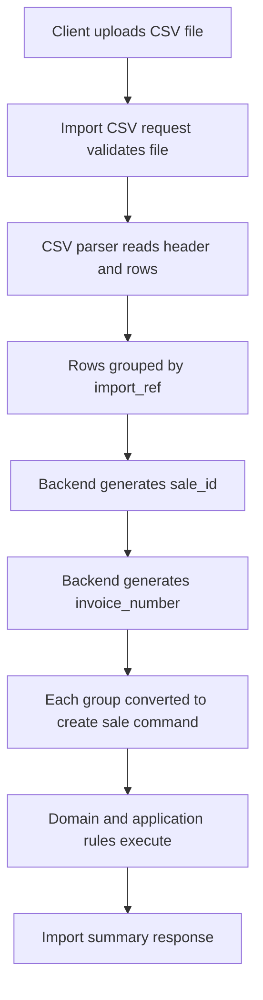

# Sales CSV Import Design

## Context

Current sales creation uses a JSON request body through `POST /api/sales`.

Current flow:

1. `SalesController::create()` receives `CreateSaleRequest`.
2. `CreateSaleRequest::getDto()` maps JSON input into `CreateSaleDto`.
3. `CreateSaleAction::__invoke()` maps DTO line items into application command line items.
4. The action dispatches `CreateSaleCommand` through the command bus.
5. Existing domain/application validation remains inside the sales command handler and domain model.

Relevant files:

- `Apps/Api/Sales/SalesController.php`
- `Apps/Api/Sales/Create/CreateSaleRequest.php`
- `Apps/Api/Sales/Create/CreateSaleDto.php`
- `Apps/Api/Sales/Create/CreateSaleAction.php`
- `Routes/api.php`
- `Src/Sales/Domain/Entities/Sale.php`
- `Database/migrations/2026_08_31_000003_create_sales_tables.php`
- `Database/migrations/2026_09_03_000001_create_sales_read_model_tables.php`

## Updated Requirement

Invoice number should be generated by the backend, not supplied by the CSV.

The CSV still needs a readable temporary grouping key so multiple product rows can be combined into one sale. Recommended field name: `import_ref`.

Examples of `import_ref` values:

- `sale-001`
- `sale-002`
- `invoice-001`
- `order-001`

The `import_ref` is only a temporary CSV grouping reference. It is not the final invoice number and should not be treated as the persisted sale ID.

## Goal

Add a CSV-based sales creation flow without breaking the existing JSON-based sales creation endpoint.

Recommended endpoint:

```http
POST /api/sales/import-csv
Content-Type: multipart/form-data
```

Recommended form field:

```text
file
```

The uploaded file should contain sales line items. One CSV row represents one product line item. Rows with the same `import_ref` are grouped into one sale. The backend then generates:

- Actual domain `SaleId`.
- Human-readable `invoice_number`.

## Recommended CSV Model

### Header

```csv
import_ref,customer_id,product_id,quantity
```

### Example

```csv
import_ref,customer_id,product_id,quantity
sale-001,0198f6d2-1111-7222-9333-a11111111111,0198f6d2-2222-7222-9333-b22222222222,2
sale-001,0198f6d2-1111-7222-9333-a11111111111,0198f6d2-3333-7222-9333-b33333333333,1
sale-002,0198f6d2-4444-7222-9333-a44444444444,0198f6d2-5555-7222-9333-b55555555555,3
```

Alternative allowed naming if preferred:

```csv
invoice_ref,customer_id,product_id,quantity
```

Recommended final choice: use `import_ref`, because it clearly means temporary import grouping reference and avoids confusion with the backend-generated `invoice_number`.

### Interpretation

- `sale-001` becomes one sale for customer `0198f6d2-1111-7222-9333-a11111111111` with two line items.
- `sale-002` becomes one sale for customer `0198f6d2-4444-7222-9333-a44444444444` with one line item.
- Backend generates final `SaleId` and `invoice_number` for each grouped sale.

## Column Definitions

| Column | Required | Type | Description |
| --- | --- | --- | --- |
| `import_ref` | Yes | string | Temporary CSV grouping key. Multiple rows with the same value become one sale. |
| `customer_id` | Yes | UUID string | Customer identifier. Must exist in the system. |
| `product_id` | Yes | UUID string | Product identifier. Must exist in the system. |
| `quantity` | Yes | integer | Product quantity. Must be greater than zero. |

## Invoice Number Design

Backend should generate `invoice_number` after a sale group is accepted.

Suggested invoice number format:

```text
INV-YYYYMMDD-NNNN
```

Examples:

- `INV-20260910-0001`
- `INV-20260910-0002`
- `INV-20260910-0003`

Alternative shorter format:

```text
INV-YYYY-NNNN
```

Examples:

- `INV-2026-0001`
- `INV-2026-0002`
- `INV-2026-0003`

Recommended final choice: `INV-YYYYMMDD-NNNN`, because it is readable, sortable, and easier to reset or audit by date.

## Important Design Decision

The CSV `import_ref` should be treated as a temporary import grouping key only.

Recommended behavior:

- The application generates the actual `SaleId` server-side using the existing `SaleId::random()` behavior.
- The application generates `invoice_number` server-side.
- The CSV `import_ref` is used only to group line items during import.
- The import response should include mapping information from CSV `import_ref` to generated `sale_id` and generated `invoice_number`.
- Since invoice number is generated by the backend, it should be persisted if the business needs to display, search, audit, or reconcile it later.

Reason:

- Users can keep CSV files simple and readable using `sale-001`, `sale-002`, or similar temporary references.
- Backend-generated invoice numbers are consistent and safer than externally supplied invoice values.
- Server-side generation prevents duplicate or malformed invoice numbers from client files.
- The existing JSON create flow already generates sale IDs server-side, so this keeps domain identity behavior consistent.

## Persistence Recommendation

If invoice number is a real business feature, it should be stored permanently.

Recommended persistence changes:

- Add `invoice_number` column to `sales` table.
- Add unique index on `sales.invoice_number`.
- Add `invoice_number` column to `sale_list_items` read model if list/index API should display it.
- Include `invoice_number` in sales created events or projection payload if read model is populated through domain events.

If invoice number is only needed in the import response and not used later, persistence can be skipped. However, this is not recommended because invoices are usually business-facing references.

## Validation Rules

Recommended request-level validation:

- Uploaded file is required.
- Uploaded file must be CSV-compatible, for example `csv` or `txt` MIME/extension.
- Uploaded file size should be limited.

Recommended row-level validation:

- CSV header must contain `import_ref`, `customer_id`, `product_id`, and `quantity`.
- `import_ref` must not be empty.
- `customer_id` must be a valid UUID.
- `product_id` must be a valid UUID.
- `quantity` must be an integer greater than zero.
- Rows with the same `import_ref` must have the same `customer_id`.
- Duplicate product rows under the same `import_ref` should either be rejected or merged. Recommended default: reject duplicates to keep import behavior explicit.

Recommended domain/application validation reuse:

- Customer existence should remain validated by the existing sales application/domain flow.
- Product existence should remain validated by the existing sales application/domain flow.
- Business rules should continue to live in the sales application/domain layer, not in the CSV parser.

## Proposed HTTP Flow



## Proposed Classes

Recommended new files:

- `Apps/Api/Sales/ImportCsv/ImportSalesCsvRequest.php`
- `Apps/Api/Sales/ImportCsv/ImportSalesCsvDto.php`
- `Apps/Api/Sales/ImportCsv/ImportSalesCsvAction.php`
- `Apps/Api/Sales/ImportCsv/SalesCsvRowDto.php`
- `Apps/Api/Sales/ImportCsv/SalesCsvImportRes.php`
- `Src/Sales/Domain/ValueObjects/InvoiceNumber.php`
- `Src/Sales/Domain/Services/InvoiceNumberGeneratorInterface.php`
- `Src/Sales/Infrastructure/Invoice/DateSequenceInvoiceNumberGenerator.php`

Recommended route addition:

```php
Route::post('/import-csv', [SalesController::class, 'importCsv']);
```

Recommended controller method:

```php
public function importCsv(
    ImportSalesCsvRequest $request,
    ImportSalesCsvAction $action,
): JsonResponse
```

## Response Model

Recommended success response:

```json
{
  "total_rows": 3,
  "created_sales": 2,
  "failed_rows": 0,
  "sales": [
    {
      "import_ref": "sale-001",
      "sale_id": "generated-sale-uuid-1",
      "invoice_number": "INV-20260910-0001"
    },
    {
      "import_ref": "sale-002",
      "sale_id": "generated-sale-uuid-2",
      "invoice_number": "INV-20260910-0002"
    }
  ],
  "errors": []
}
```

Recommended validation error response:

```json
{
  "total_rows": 3,
  "created_sales": 0,
  "failed_rows": 1,
  "sales": [],
  "errors": [
    {
      "row": 2,
      "import_ref": "sale-001",
      "field": "quantity",
      "message": "Quantity must be greater than zero."
    }
  ]
}
```

## Failure Strategy

Recommended default: fail the entire import if any row is invalid.

Reason:

- Prevents partial imports that are hard to retry safely.
- Keeps implementation simpler and safer.
- User can fix the CSV and re-upload it.

Alternative for later enhancement:

- Partial success mode, where valid sale groups are created and invalid groups are returned as errors.
- This should be explicit through a request option such as `mode=partial`.

## Implementation Todo List

- Add route `POST /api/sales/import-csv`.
- Add `SalesController::importCsv()` method.
- Add `ImportSalesCsvRequest` to validate uploaded file.
- Add DTOs for parsed import input and row errors.
- Add `ImportSalesCsvAction` to parse CSV and group rows by `import_ref`.
- Add `invoice_number` persistence if invoice number must be visible/searchable later.
- Add invoice number value object and backend generator.
- Convert each valid group into the current create sales command flow with generated `SaleId` and generated `invoice_number`.
- Return an import summary response that maps `import_ref` to generated `sale_id` and generated `invoice_number`.
- Add feature tests for successful import, invalid file, invalid row, mismatched customer in same import group, duplicate product rows, and generated invoice number uniqueness.

## Recommended Execution Notes

- Do not modify the existing JSON create endpoint unless explicitly requested.
- Prefer reusing the current create sale command flow instead of duplicating business rules in the import layer.
- Keep CSV parsing concerns in the HTTP/application boundary, not in the domain entity.
- Keep the sales domain model unaware of CSV format.
- Treat `import_ref` as temporary CSV-only data.
- Treat `invoice_number` as backend-generated business data.
